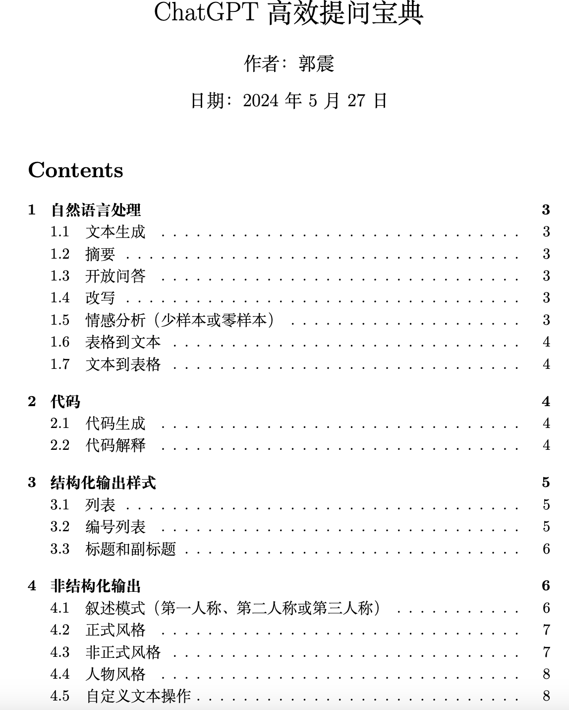
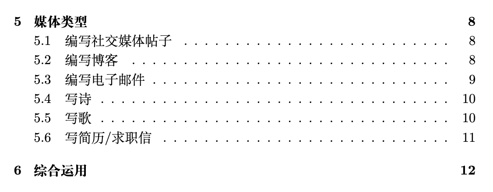
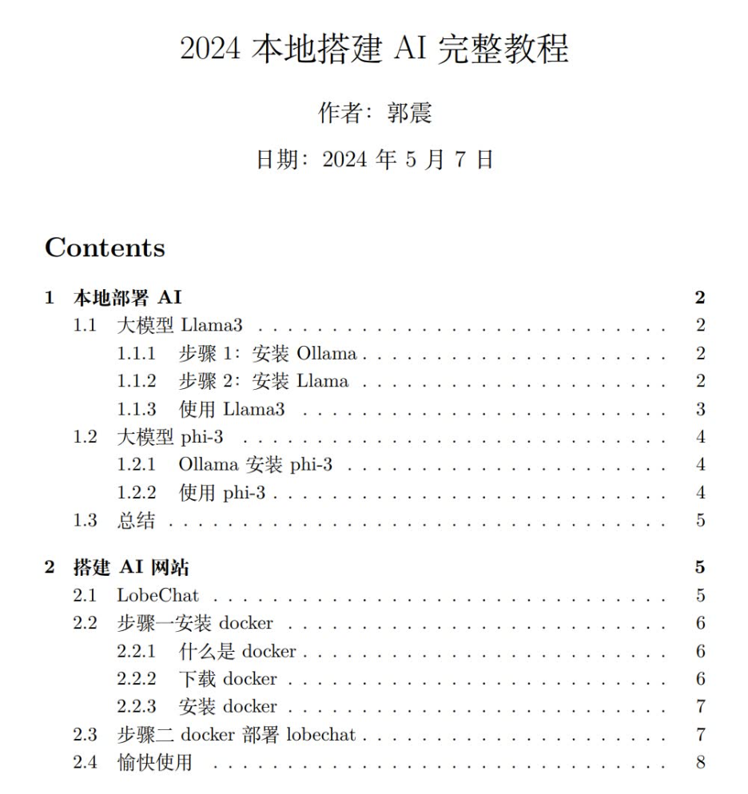
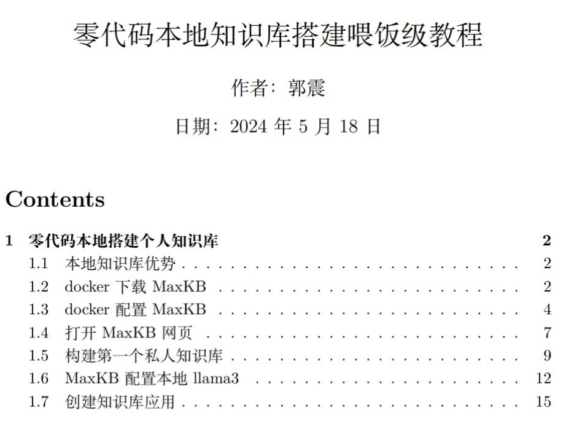

# myAI
# AI 初学者教程

## 简介

欢迎来到我的GitHub仓库！最近，我编写了三个教程，帮助AI初学者高效使用AI。这些教程涵盖了本地搭建AI、使用AI而无需花费订阅费用，以及构建本地知识库以处理个人文档。以下是每个教程的详细信息。

## 教程

### 1. 高效使用AI

在这个教程中，我指导AI初学者如何最有效地使用AI工具。目标是无需昂贵的订阅费用或使用限制，最大限度地利用AI技术。该教程包含详细的分步说明和使用技巧。 📚

具体内容包括：

1. 自然语言处理
   - 文本生成
   - 摘要
   - 开放问答
   - 改写
   - 情感分析
   - 表格到文本
   - 文本到表格

2. 代码
   - 代码生成
   - 代码解释

3. 结构化输出样式
   - 列表
   - 编号列表
   - 标题和副标题

4. 非结构化输出
   - 叙述模式
   - 正式风格
   - 非正式风格
   - 人物风格
   - 自定义文本操作

5. 媒体类型
   - 编写社交媒体帖子
   - 编写博客
   - 编写电子邮件
   - 写诗
   - 写歌
   - 写简历/求职信

6. 综合运用

  

  

### 2. 本地搭建AI

此教程提供了在本地机器上搭建AI工具的详细步骤。通过遵循本教程，您可以无限制地使用AI工具，节省资金并确保持续访问。教程涵盖了从安装到基本使用的所有内容。 💻

具体内容包括：

1. 本地部署 AI
   - 大模型 Llama3
     - 步骤 1: 安装 Ollama
     - 步骤 2: 安装 Llama
     - 使用 Llama3
   - 大模型 phi-3
     - Ollama 安装 phi-3
     - 使用 phi-3

2. 搭建 AI 网站
   - LobeChat
   - 步骤二: 安装 docker
     - 什么是 docker
     - 下载 docker
     - 安装 docker
   - 步骤三: docker 部署 lobecha

  

### 3. 搭建本地知识库

第三个教程重点介绍如何通过将个人文档输入到AI系统中来创建本地知识库。此设置确保您的数据在本地处理，保证安全和隐私。教程包括设置系统和有效管理知识库的步骤。 🔐

具体内容包括：

1. 零代码本地搭建个人知识库
   - 本地知识库优势
   - docker 下载 MaxKB
   - docker 配置 MaxKB
   - 打开 MaxKB 网页
   - 构建第一个私人知识库
   - MaxKB 配置本地 Llama3
   - 创建知识库应用

  

## 结论

这些教程旨在为AI初学者提供必要的工具和知识，使其能够在不产生持续费用或隐私担忧的情况下，充分利用AI的强大功能。按照每部分的链接和说明开始您的AI之旅吧！

以上三个教程，由我编写，给这个库加个star，全部开源，免费获取，获取方法，关注下面我的公众号，依次回复消息：提问，AI, 知识库，免费领取。

  

如果有任何问题或需要进一步的帮助，请随时联系我。享受您的AI之旅！ 🚀
